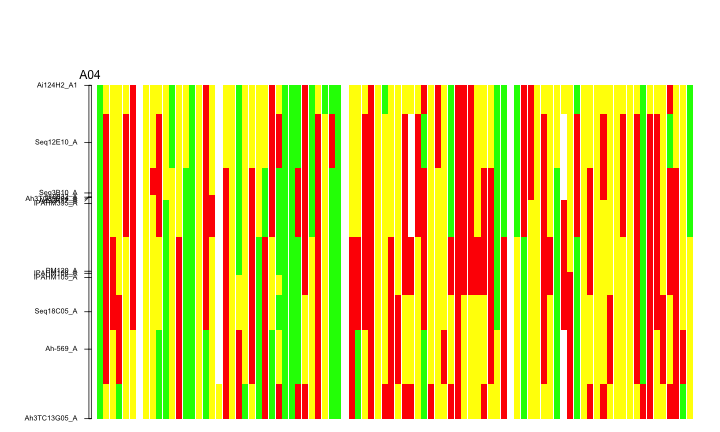
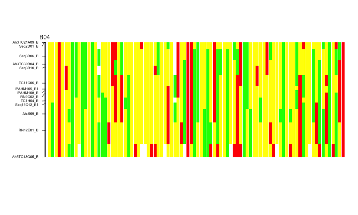

```r
library(ggr)
library(knitr)
```


Let's read two example files provided with the package


```r
mymap<-read.table(system.file("extdata","Nguepjop.et.al.2016.map.txt",package="ggr"))
myg<-read.table(system.file("extdata","Nguepjop.et.al.2016.txt",package="ggr"))
```

The files look like that:


|V1           |V2  |   V3|
|:------------|:---|----:|
|Ai124H2_A1   |A04 |  0.0|
|Seq12E10_A   |A04 | 16.4|
|Seq3B10_A    |A04 | 30.8|
|gi-0832_A    |A04 | 32.0|
|Ah3TC39B04_A |A04 | 32.0|
|Ad92K17_A    |A04 | 32.0|


|V1           |V2 |V3 |V4 |V5 |V6 |V7 |V8 |V9 |V10 |V11 |V12 |V13 |V14 |V15 |V16 |V17 |V18 |V19 |V20 |V21 |V22 |V23 |V24 |V25 |V26 |V27 |V28 |V29 |V30 |V31 |V32 |V33 |V34 |V35 |V36 |V37 |V38 |V39 |V40 |V41 |V42 |V43 |V44 |V45 |V46 |V47 |V48 |V49 |V50 |V51 |V52 |V53 |V54 |V55 |V56 |V57 |V58 |V59 |V60 |V61 |V62 |V63 |V64 |V65 |V66 |V67 |V68 |V69 |V70 |V71 |V72 |V73 |V74 |V75 |V76 |V77 |V78 |V79 |V80 |V81 |V82 |V83 |V84 |V85 |V86 |V87 |V88 |V89 |V90 |V91 |
|:------------|:--|:--|:--|:--|:--|:--|:--|:--|:---|:---|:---|:---|:---|:---|:---|:---|:---|:---|:---|:---|:---|:---|:---|:---|:---|:---|:---|:---|:---|:---|:---|:---|:---|:---|:---|:---|:---|:---|:---|:---|:---|:---|:---|:---|:---|:---|:---|:---|:---|:---|:---|:---|:---|:---|:---|:---|:---|:---|:---|:---|:---|:---|:---|:---|:---|:---|:---|:---|:---|:---|:---|:---|:---|:---|:---|:---|:---|:---|:---|:---|:---|:---|:---|:---|:---|:---|:---|:---|:---|:---|
|Ai124H2_A1   |B  |H  |H  |H  |H  |A  |-  |H  |H   |H   |H   |B   |H   |H   |B   |H   |A   |H   |-   |H   |H   |B   |H   |H   |H   |H   |A   |H   |B   |B   |B   |A   |B   |H   |B   |B   |B   |-   |H   |H   |H   |A   |H   |B   |H   |H   |H   |H   |H   |A   |H   |A   |H   |B   |A   |A   |A   |H   |H   |H   |B   |B   |-   |B   |A   |A   |H   |H   |H   |H   |H   |H   |B   |H   |H   |H   |H   |H   |H   |H   |H   |H   |B   |H   |H   |H   |A   |H   |H   |B   |
|Seq12E10_A   |B  |A  |H  |H  |A  |A  |-  |H  |H   |A   |H   |B   |H   |H   |B   |H   |A   |H   |-   |H   |H   |B   |H   |H   |H   |H   |A   |A   |B   |B   |B   |A   |B   |A   |H   |A   |B   |-   |H   |H   |A   |A   |H   |H   |H   |H   |A   |-   |A   |B   |H   |A   |H   |B   |A   |A   |A   |H   |H   |H   |B   |B   |-   |B   |A   |A   |H   |A   |H   |H   |-   |H   |A   |H   |H   |H   |A   |H   |H   |A   |H   |A   |B   |A   |A   |H   |B   |H   |H   |B   |
|Seq3B10_A    |B  |A  |H  |H  |A  |A  |-  |H  |A   |A   |H   |H   |H   |B   |B   |H   |A   |H   |-   |A   |H   |B   |H   |A   |H   |B   |A   |B   |B   |B   |A   |A   |B   |A   |H   |B   |B   |-   |H   |H   |A   |A   |H   |H   |H   |H   |A   |-   |A   |A   |H   |H   |H   |B   |A   |A   |A   |H   |A   |A   |B   |B   |-   |B   |A   |A   |H   |A   |H   |B   |-   |H   |A   |H   |A   |H   |A   |H   |H   |A   |H   |A   |B   |A   |A   |H   |A   |A   |H   |B   |
|gi-0832_A    |B  |A  |H  |H  |A  |A  |-  |H  |H   |A   |H   |H   |H   |B   |B   |H   |A   |A   |-   |A   |H   |B   |H   |A   |H   |B   |A   |B   |B   |B   |A   |A   |B   |A   |H   |B   |B   |-   |H   |H   |A   |A   |H   |H   |H   |H   |A   |-   |A   |A   |H   |H   |H   |B   |A   |A   |A   |H   |A   |A   |B   |B   |-   |B   |A   |A   |H   |A   |H   |B   |-   |H   |A   |H   |A   |H   |A   |H   |H   |A   |H   |A   |B   |A   |A   |H   |A   |A   |H   |B   |
|Ah3TC39B04_A |B  |A  |H  |H  |A  |A  |-  |H  |H   |A   |H   |H   |H   |B   |B   |H   |A   |A   |-   |A   |H   |B   |H   |A   |H   |B   |A   |B   |B   |B   |A   |A   |B   |A   |H   |B   |B   |-   |H   |H   |A   |A   |H   |H   |H   |H   |A   |-   |A   |A   |H   |H   |H   |B   |A   |A   |A   |H   |A   |A   |B   |B   |-   |B   |A   |A   |H   |A   |H   |B   |-   |H   |A   |H   |A   |H   |A   |H   |H   |A   |H   |A   |B   |A   |A   |H   |A   |A   |H   |B   |
|Ad92K17_A    |B  |A  |H  |H  |A  |A  |-  |H  |H   |A   |H   |H   |H   |B   |B   |H   |A   |A   |-   |A   |H   |B   |H   |A   |H   |B   |A   |B   |B   |B   |A   |A   |B   |A   |H   |B   |B   |-   |H   |H   |A   |A   |H   |H   |H   |H   |A   |-   |A   |A   |H   |H   |H   |B   |A   |A   |A   |H   |A   |A   |B   |B   |-   |B   |A   |A   |H   |A   |H   |B   |-   |H   |A   |H   |A   |H   |A   |H   |H   |A   |H   |A   |B   |A   |A   |H   |A   |A   |H   |B   |

The map needs to be converted to the R/qtl format


```r
mymap<-as.map(mymap)
mymap
```

```
## $A04
##   Ai124H2_A1   Seq12E10_A    Seq3B10_A    gi-0832_A Ah3TC39B04_A 
##          0.0         16.4         30.8         32.0         32.0 
##    Ad92K17_A   IPAHM395_A      PM120_A   IPAHM108_A   IPAHM105_A 
##         32.0         33.8         53.2         53.8         55.0 
##   Seq18C05_A     Ah-569_A Ah3TC13G05_A 
##         64.8         75.5         95.4 
## 
## $B04
## Ah3TC21A09_B    Seq2D01_B    Seq3B06_B Ah3TC39B04_B    Seq3B10_B 
##          0.0          0.0          7.9         12.5         14.2 
##    TC11C06_B  IPAHM105_B1   IPAHM108_B     RN9C02_B     TC1H04_B 
##         23.4         26.8         27.9         29.6         33.6 
##  Seq15C12_B1     Ah-569_B    RN12E01_B Ah3TC13G05_B 
##         35.3         41.1         50.6         65.9
```

Let's get the genotype codes that are used in the genotype table myg :


```r
codes<-unique(c(as.matrix(myg[,-1])))
codes
```

```
## [1] "B" "H" "A" "-"
```

We will need a vector of named colors, using codes as names, to plot the genotypes blocs

```r
mycolors<-c("green","yellow","red","white")
names(mycolors)<-codes
mycolors
```

```
##        B        H        A        - 
##  "green" "yellow"    "red"  "white"
```


Let's use the `gg` function with myg, mymap and mycolors. There is a couple of parameters to explore, especially parameters of the `maplot` function that is used to plot the map.


```r
gg(x = myg,map = mymap,col =mycolors,lmarg = 0.06 ,inter=0.1,sw=-1,first = 0.05,position=F)
```




